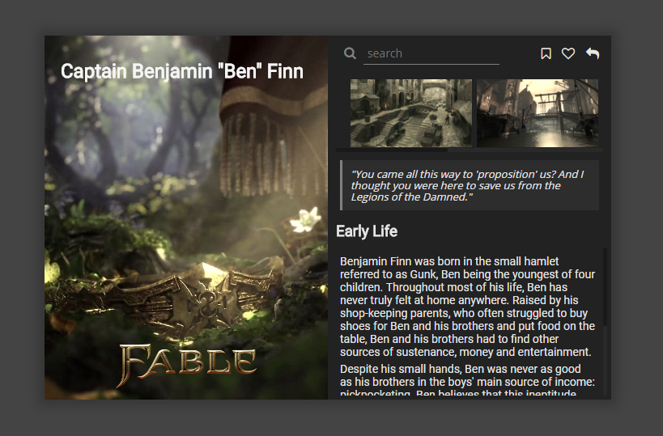

Carte en HTML et CSS
====

_Date : 2017 - 06 - 09_  
Carte réaliser qu'avec du HTML et du CSS

Technologies utiliser :
----
* HTML 5
* CSS 3

Source :
----
* [Google fonts](http://fonts.google.com "Google fonts")
* [Font awesome](http://fontawesome.io/ "Font awesome")
* [Jeuxvideo.com (images)](http://www.jeuxvideo.com/screenshots/71894-0-39 "Jeuxvideo.com")  
> RAFAIDEEN Richard
